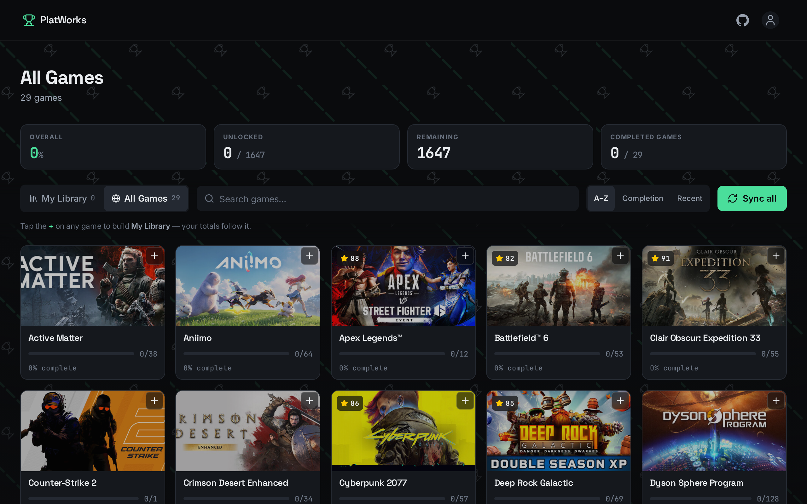
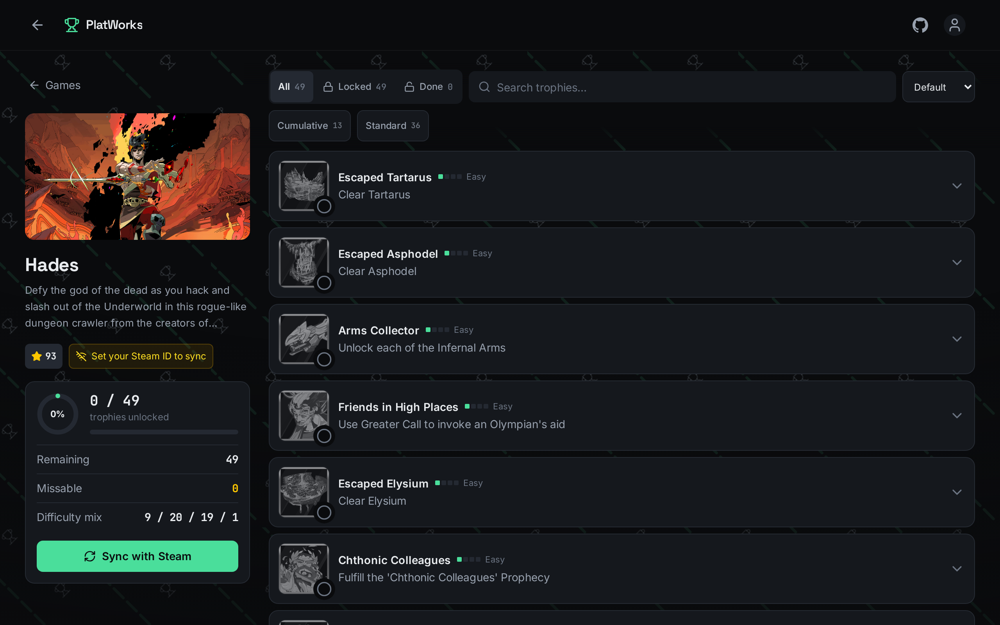

# PlatWorks

**Every Steam achievement, unpacked into steps you can actually follow.**

PlatWorks turns a game's trophy list into a walkthrough. Instead of a wall of greyed-out names, you get
step-by-step instructions for each trophy, a loud warning when it can be permanently missed, and a map
link for the ones tied to a specific corner of the world.

[](https://github.com/HeroSnake/Platworks)

---

## Your library



Add the games you actually own and **every number on the page is measured against that list** — not the
whole catalogue. So your percentage is your percentage, and syncing a game you don't play costs you
nothing.

Tap the **+** on any card to add it. Your overall completion, the trophies left, and the "Sync all"
button all follow your selection.

## A game's trophies



Every trophy is a row you can **tap to tick off** — no checkboxes in a separate column, so the name of a
long trophy like *"Rennala, Queen of the Full Moon"* still fits on one line on a phone.

Some rows earn an extra badge:

| Badge | What it means |
|---|---|
| **Missable** | You can lock this one out permanently. Read the warning before you start. |
| **Secret** | Steam hides the description until you unlock it. |
| **Cumulative** | An in-game counter. The number you need is in the steps. |
| **Multiplayer** | Needs other players. |

The difficulty pips on each row are a four-step scale, shown as pips rather than colour alone — so the
rating survives being colour-blind, greyscale, or read on a bright screen outdoors.

## Connecting your Steam account

Optional, and read-only.

PlatWorks can pull your real achievement list from a **public** Steam profile, so you don't tick 1647
boxes by hand. Paste a Steam ID, a vanity URL, or a profile link into the account button in the top-right
and it syncs.

**There is no sign-up, no password, and no API key.** PlatWorks only reads Steam's public community
endpoints. Your progress lives in your browser, and disconnecting clears it.

## What else is in here

- **Step-by-step guides** for every trophy, with video walkthroughs and community tips where they exist
- **Missable warnings** on the trophies where a single wrong choice costs you the achievement forever
- **Map links** for open-world games, from both the game header and individual trophies
- **Search and filter** — find games by name, trophies by name or description, sort by completion, recency
  or difficulty, and filter by locked state and trophy type
- **Six colour themes** — Ember, Amber, Cobalt, Matrix, Cyberpunk and Vapor, each with its own palette and
  accent colour. Pick one from the account menu; it sticks, and there is no flash on load
- **Readable on a phone** — every control has a 40px+ tap target, and the whole app honours your
  reduced-motion setting

## The catalogue

**29 games, 1647 achievements**, every one with its official trophy artwork committed to this repo — so
the art can't disappear because a CDN moved a file or rate-limited a request.

| Game | Achievements | Map |
|------|-------------:|:---:|
| Active Matter | 38 | |
| Aniimo | 64 | |
| Apex Legends | 12 | |
| Battlefield 6 | 53 | |
| Clair Obscur: Expedition 33 | 55 | ✓ |
| Counter-Strike 2 | 1 | |
| Crimson Desert | 34 | ✓ |
| Cyberpunk 2077 | 57 | ✓ |
| Deep Rock Galactic | 69 | |
| Dyson Sphere Program | 128 | |
| Elden Ring | 42 | ✓ |
| Grand Theft Auto V Enhanced | 77 | ✓ |
| Hades | 49 | |
| Marathon | 14 | |
| Monster Hunter Wilds | 50 | ✓ |
| Monster Hunter: World | 100 | |
| No Man's Sky | 27 | |
| Palworld | 75 | ✓ |
| Red Dead Redemption 2 | 51 | ✓ |
| Remnant II | 65 | |
| Rust | 116 | |
| Starfield | 82 | ✓ |
| Steep | 41 | |
| Terraria | 137 | ✓ |
| The Witcher 3: Wild Hunt | 78 | ✓ |
| Tom Clancy's Rainbow Six Siege | 48 | |
| Tower Factory | 21 | |
| Valheim | 53 | ✓ |
| WARDOGS | 10 | |

Want a game that's missing? [Open an issue](https://github.com/HeroSnake/Platworks/issues) and name it.

## Running it yourself

```bash
git clone https://github.com/HeroSnake/Platworks.git
cd Platworks
npm install
npm run dev
```

Open the URL it prints. No environment variables, no database, no Steam API key.

<details>
<summary>Contributing</summary>

Project rules live in [`.github/agents/`](.github/agents/) — the traps, the architecture, and why things
are the way they are. Start with
[`platworks-dev.agent.md`](.github/agents/platworks-dev.agent.md); it routes you to whichever domain file
owns what you're changing.

Built with SvelteKit 3, Svelte 5 runes, Tailwind CSS 4 and TypeScript. Deployed on Vercel.

</details>
